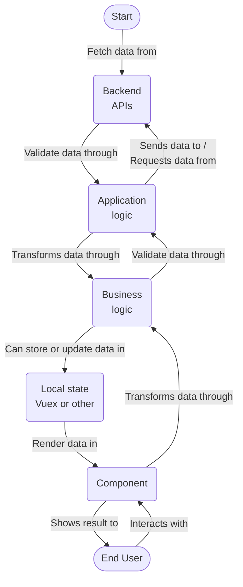

# Code organization and folder structure

As opposed to the traditional way suggested by the vue guidelines of organizing files:

```bash
--public
----img
------icons
----favicon.ico
----index.html
----robots.txt
--src
----assets
------logo.png
----components
------HelloWorld.vue
----router
------index.ts
----store
------index.ts
----views
------About.vue
------Home.vue
----App.vue
----main.ts
----registerServiceWorkers.ts
----shims-vue.d.ts
--tests
----e2e
----unit
```

It has been decided that the following project will adopt an organization by application module.
The reason behind that is that it helps to reason about the code the same way we reason about the product.
The other benefit is that it avoids heavy nesting of sub-folders, and as such may avoid duplicating some code.

The structure used is as follows:

```bash
├── forecasts-review
│   ├── components
│   │   ├── demand
│   │   └── planning
│   ├── composables
│   ├── store
│   └── typings
├── orders
│   ├── backend
│   ├── components
│   ├── composables
│   ├── constants
│   ├── schemas
│   ├── store
│   └── typings
│       └── dto
```

> Note: At the moment, the tests are still put in a separate folder, but this may change later

For a more detailed walkthrough of this folder structure, we may need to take a high level overview of what the usual data flow looks like in a frontend application. The following chart is a simplified version of the most frequently encountered flow:



The folders structure reflects this flow:

- The `backend` folder contains application logic to interact with the backend api module related to the frontend one
- The `components` folder contains the vue components (SFC) responsible for displaying data and dispatching the effects of the user's interactions
- The `composables` folder contains both logic that is shared between multiple components in the same module, and important (as in should be carefully tested) business logic
- The `constants` folder contains data that doesn't change while the application is running
- The `schemas` folder contains `json` schemas to be used for runtime validation when communicating with the backend
- The `store` folder contains the locally stored data and the logic to retrieve and update it
- The `typings` folder contains the types used in compile time validation

  > - The [`dto`](https://en.wikipedia.org/wiki/Data_transfer_object) folder, in particular, contains the types dedicated to the data that flows from external services into the application, and vice-versa
